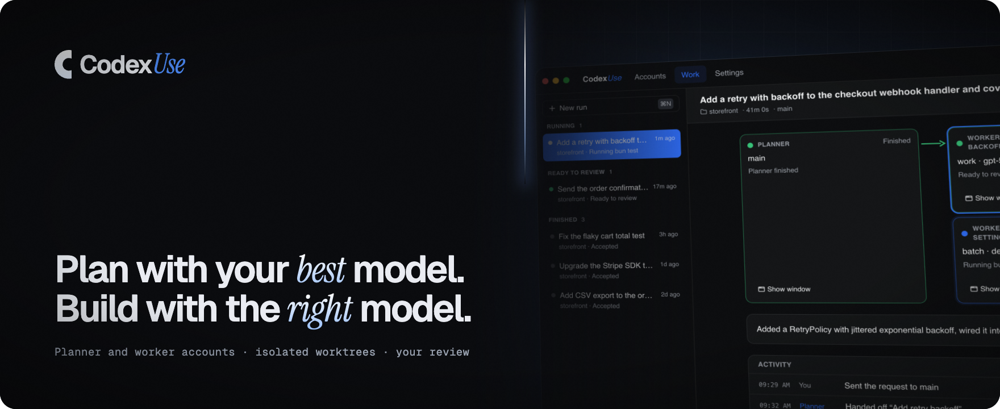
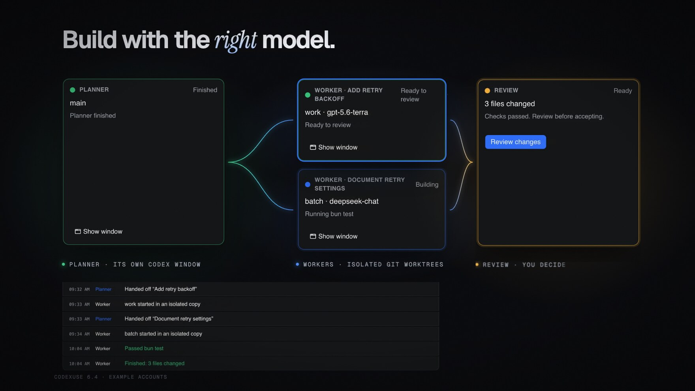
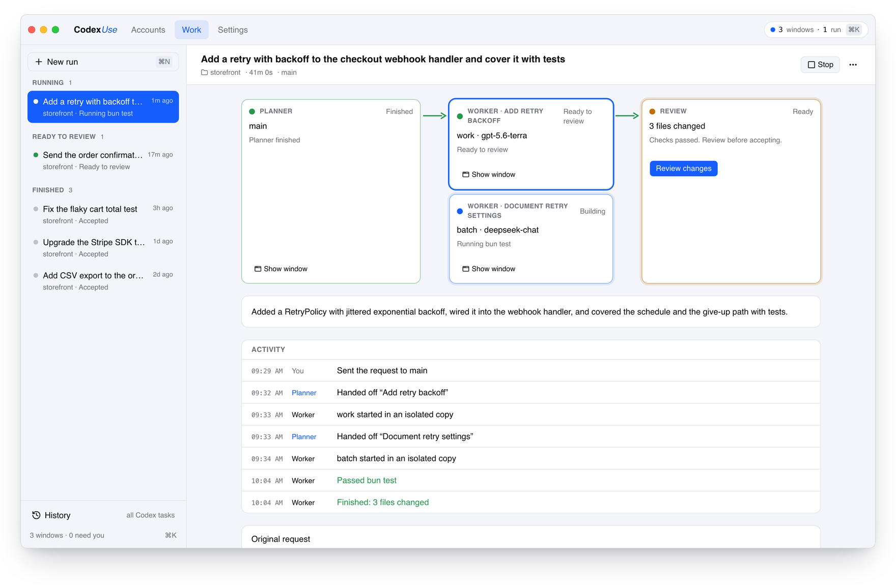
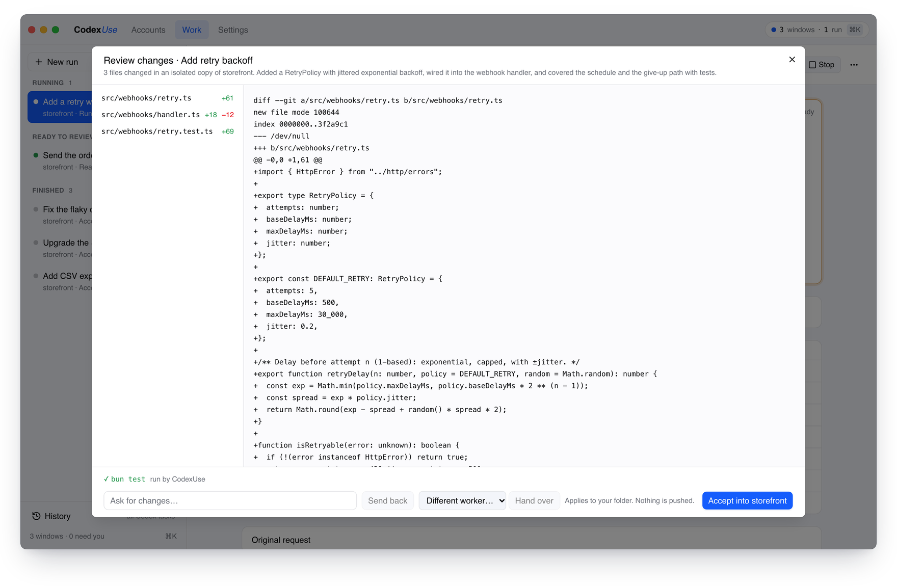
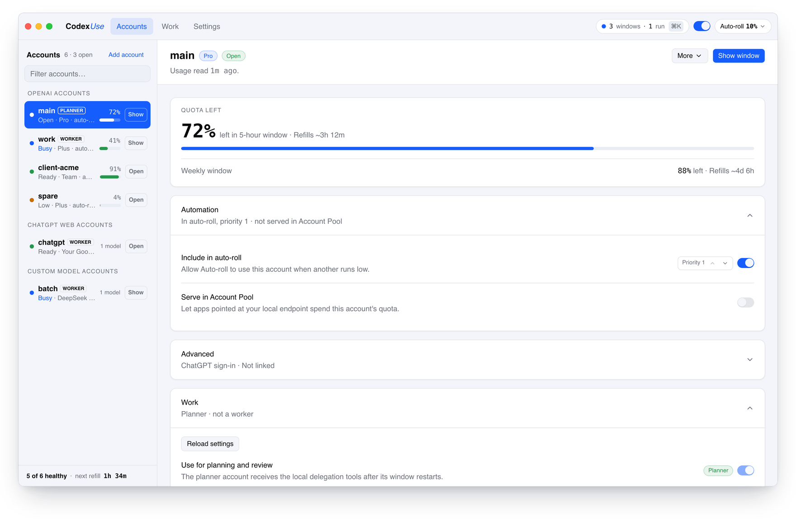
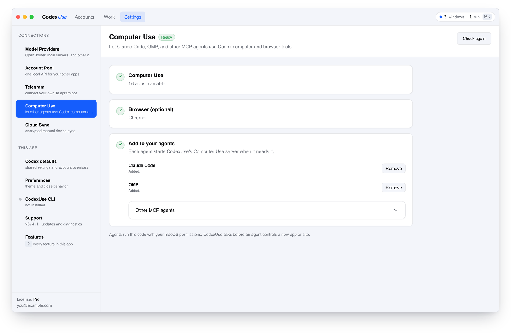

  

  
  
  

  <a href="https://github.com/hweihwang/codexuse-desktop-releases/releases/latest/download/stable-macos-arm64-CodexUse.dmg"><b>macOS</b></a> ·
  <a href="https://github.com/hweihwang/codexuse-desktop-releases/releases/latest/download/win-x64-CodexUse-Setup.zip"><b>Windows</b></a> ·
  <a href="https://github.com/hweihwang/codexuse-desktop-releases/releases/latest/download/linux-x64-CodexUse-Setup.tar.gz"><b>Linux x64</b></a> ·
  <a href="https://github.com/hweihwang/codexuse-desktop-releases/releases/latest/download/linux-arm64-CodexUse-Setup.tar.gz"><b>Linux arm64</b></a> ·
  <a href="https://codexuse.com"><b>Website</b></a> ·
  <a href="https://codexuse.com/docs/"><b>Docs</b></a>

CodexUse is a desktop app for people who use the Codex app and the Codex CLI with more than one account. Every account keeps its own Codex home. On a Mac, one account plans a task in its own Codex window, another account builds it in an isolated Git worktree, and you review the diff before you accept it.

This repository holds the public downloads and the issue tracker. It does not contain the app source. CodexUse is independent and not affiliated with OpenAI.

  
   
  <a href="https://codexuse.com/#film">Watch the one-minute film</a>

## Work: plan on one account, build on another

<picture>
  <source media="(prefers-color-scheme: dark)" srcset=".github/assets/work-dark.png">
  
</picture>

Describe the task, pick a folder, and choose separate planner and worker accounts. The planner plans in its own Codex window. Each worker builds in an isolated Git worktree with a bounded brief and runs your checks. Work needs macOS.

<picture>
  <source media="(prefers-color-scheme: dark)" srcset=".github/assets/review-dark.png">
  
</picture>

Read the diff and the check results, then accept. Accept applies the changes to your working folder; you commit and push them yourself. Work does not replace Codex subagents.

## Accounts: every account in its own home

<picture>
  <source media="(prefers-color-scheme: dark)" srcset=".github/assets/accounts-dark.png">
  
</picture>

- **One Codex window per account** on macOS. Open starts it, Show brings it to the front, and no account signs another out.
- **Status in one word:** Open, Busy, Ready, Low, Needs sign-in, Needs setup.
- **Headroom and refill timers** as Codex reports them. Refill controls attempt short background requests; they do not add quota or speed up refill times.
- **Auto-roll** on macOS moves new work to the next account below a threshold you set. It does not move a running conversation.
- **Shared Codex defaults** with small per-account overrides.

## More than OpenAI logins

- **ChatGPT Web accounts** answer Codex tasks through the ChatGPT session in your regular Chrome and spend the Chat allowance, not any account's Codex allowance. This is not an official OpenAI integration, and automating ChatGPT may not be permitted under your agreement with OpenAI. Setup needs a signed-in OpenAI account on the same computer, an OpenAI Tunnel with a runtime key, and a connector you create in ChatGPT Developer Mode. [Read the setup and the terms first](https://codexuse.com/docs/chatgpt-web/).
- **Custom-model accounts** run OpenRouter, DeepSeek, Groq, or a local model inside the Codex app as their own account. You pay the provider directly, and dictation and browser control are unavailable on them.
- **Account Pool** serves selected accounts to another OpenAI-compatible app as one local API, with load balancing and failover. It runs on your computer and does not raise any account's limit.

## Computer Use for agents

<picture>
  <source media="(prefers-color-scheme: dark)" srcset=".github/assets/computer-use-dark.png">
  
</picture>

Claude Code, OMP, and other MCP agents can control Mac apps, and Chrome, Edge, or Brave, through the Computer Use runtime in ChatGPT Desktop. Their own model decides every action, and CodexUse asks before an agent controls a new app or site. It needs macOS. This is not an official OpenAI integration, and the runtime can change with any ChatGPT update.

## Download and install

| Platform | Package | Notes |
| --- | --- | --- |
| macOS 13+ on Apple Silicon | [`stable-macos-arm64-CodexUse.dmg`](https://github.com/hweihwang/codexuse-desktop-releases/releases/latest/download/stable-macos-arm64-CodexUse.dmg) or `brew install --cask hweihwang/codexuse/codexuse` | Updates in the app. Homebrew installs update with `brew upgrade --cask codexuse`. Intel Macs are not supported by the desktop app. |
| Windows 11 x64 | [`win-x64-CodexUse-Setup.zip`](https://github.com/hweihwang/codexuse-desktop-releases/releases/latest/download/win-x64-CodexUse-Setup.zip) | Windows on ARM runs it under emulation. The installer is unsigned, so SmartScreen may warn. Install new versions manually. |
| Ubuntu 24.04 x64 | [`linux-x64-CodexUse-Setup.tar.gz`](https://github.com/hweihwang/codexuse-desktop-releases/releases/latest/download/linux-x64-CodexUse-Setup.tar.gz) | Needs GTK and WebKitGTK 4.1. |
| Ubuntu 24.04 arm64 | [`linux-arm64-CodexUse-Setup.tar.gz`](https://github.com/hweihwang/codexuse-desktop-releases/releases/latest/download/linux-arm64-CodexUse-Setup.tar.gz) | Needs GTK and WebKitGTK 4.1. |

On macOS, open the disk image and drag CodexUse into Applications. If macOS reports a damaged or unverified download, stop and follow the [troubleshooting guide](https://codexuse.com/docs/troubleshooting/). Do not turn off macOS security checks.

| Feature | macOS | Windows | Linux |
| --- | :---: | :---: | :---: |
| Separate accounts, each in its own Codex home | ✓ | ✓ | ✓ |
| ChatGPT Web and custom-model accounts | ✓ | ✓ | ✓ |
| Headroom, refill timers, History, Account Pool, Cloud Sync | ✓ | ✓ | ✓ |
| One Codex window per account, Work, Auto-roll, Telegram | ✓ | | |
| Computer Use for agents | ✓ | | |

The features marked macOS only drive OpenAI's Codex app or ChatGPT Desktop for Mac. The separate [CLI](https://codexuse.com/docs/cli/) runs on all three platforms with `npm install -g codexuse-cli`; it does not have every desktop feature.

OpenAI accounts sign in with the Codex CLI OAuth flow and need no OpenAI API key. Custom-model accounts use a provider credential that you supply.

## Trial and Pro

Try every app feature for 7 days. After that, features lock until a Pro license is activated. Nothing is deleted, and there is no permanent free tier.

Pro is a one-time lifetime license for up to 5 computers in any mix of macOS, Windows, and Linux: $39 regular price, currently $19.50 with the code SUMMER50. There is a 30-day refund window. Account quotas and provider charges stay separate.

Buy inside CodexUse to activate automatically. If you buy on the website, enter the license key from your Gumroad receipt in CodexUse. If you already paid, do not buy again.

## Links

[Website](https://codexuse.com/) · [Getting started](https://codexuse.com/docs/getting-started/) · [Work](https://codexuse.com/docs/work/) · [Accounts](https://codexuse.com/docs/accounts/) · [Platforms](https://codexuse.com/docs/desktop/) · [Release notes](https://codexuse.com/releases/) · [Report an issue](https://github.com/hweihwang/codexuse-desktop-releases/issues)
